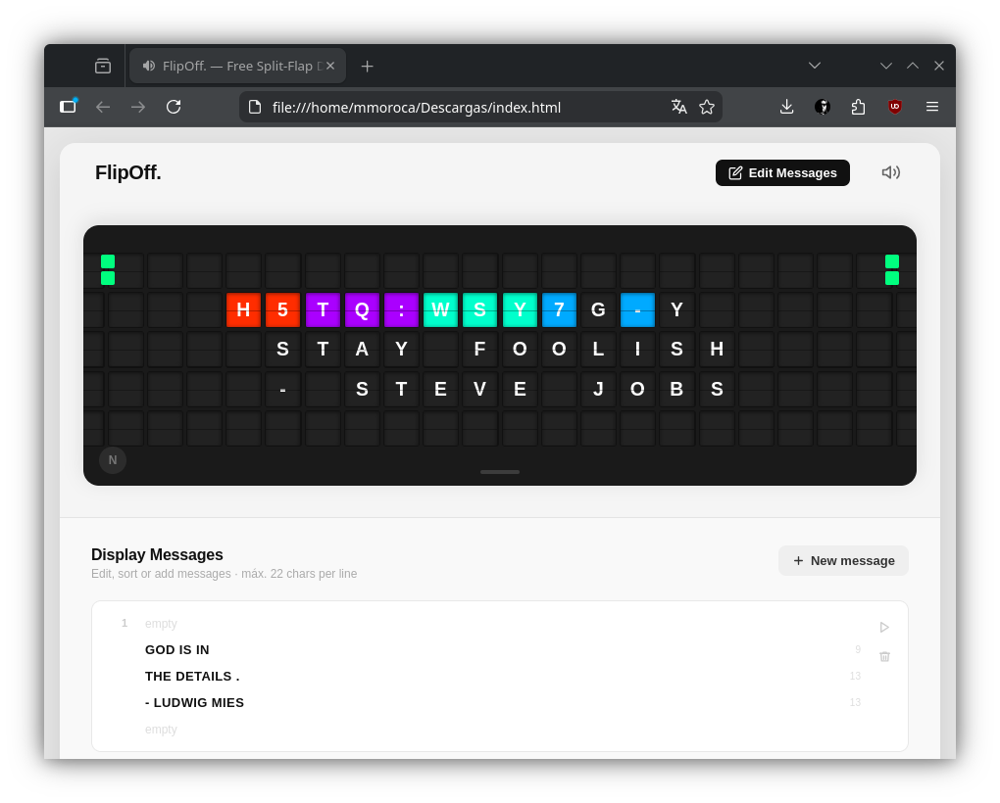

# FlipOff.

**Turn any TV into a retro split-flap display.** The classic flip-board look. And it's free.



## What is this?

FlipOff is a free, open-source web app that emulates a classic mechanical split-flap (flip-board) airport terminal display — the kind you'd see at train stations and airports. It runs full-screen in any browser, turning a TV or large monitor into a beautiful retro display.

Just open `index.html` and go.

## Features

- Realistic split-flap animation with colorful scramble transitions
- Authentic mechanical clacking sound (recorded from a real split-flap display)
- Auto-rotating inspirational quotes
- Fullscreen TV mode (press `F`)
- Keyboard controls for manual navigation
- Works offline — zero external dependencies
- Responsive from mobile to 4K displays
- Pure vanilla HTML/CSS/JS — no frameworks, no build tools, no npm
- All in one single HTML file
- Add, edit, delete and sort the messages

## Quick Start

1. Open `index.html` in a browser (or serve with any static file server)
2. Click anywhere to enable audio
3. Press `F` for fullscreen TV mode
4. Click on "Edit Messages" to edit your messages

## Keyboard Shortcuts

| Key | Action |
|-----|--------|
| `Enter` / `Space` | Next message |
| `Arrow Left` | Previous message |
| `Arrow Right` | Next message |
| `F` | Toggle fullscreen |
| `M` | Toggle mute |
| `Escape` | Exit fullscreen |

## How It Works

Each tile on the board is an independent element that can animate through a scramble sequence (rapid random characters with colored backgrounds) before settling on the final character. Only tiles whose content changes between messages animate — just like a real mechanical board.

The sound is a single recorded audio clip of a real split-flap transition, played once per message change to perfectly sync with the visual animation.

## File Structure

```
flipoff/
  index.html           — Single-page app
```

## Customization

Edit javascript to change:
- **Messages**: Add your own quotes or text
- **Grid size**: Adjust `GRID_COLS` and `GRID_ROWS`
- **Timing**: Tweak `SCRAMBLE_DURATION`, `STAGGER_DELAY`, etc.
- **Colors**: Modify `SCRAMBLE_COLORS` and `ACCENT_COLORS`

## License

MIT — do whatever you want with it.
